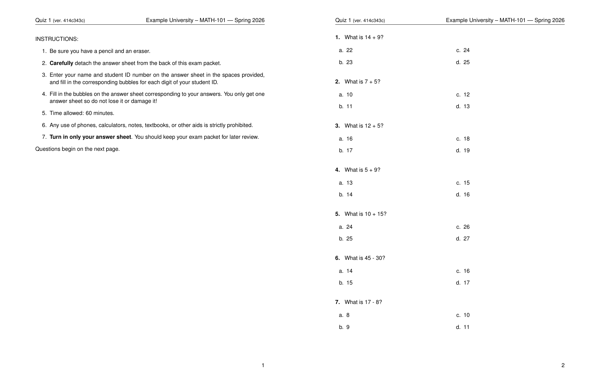
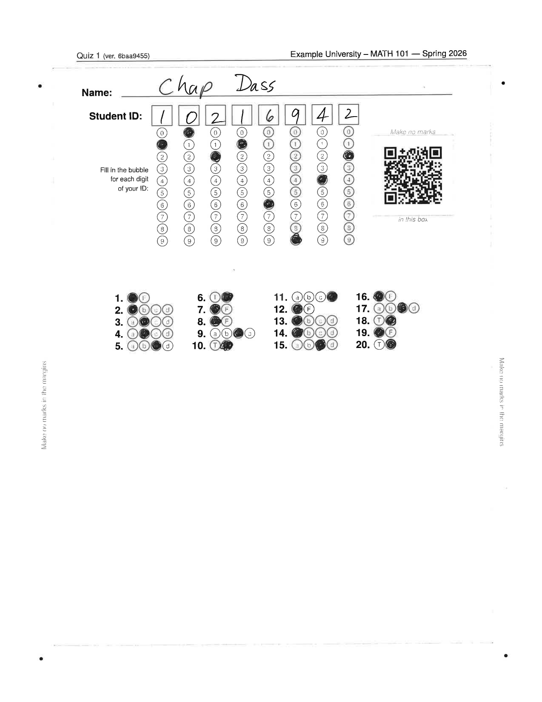
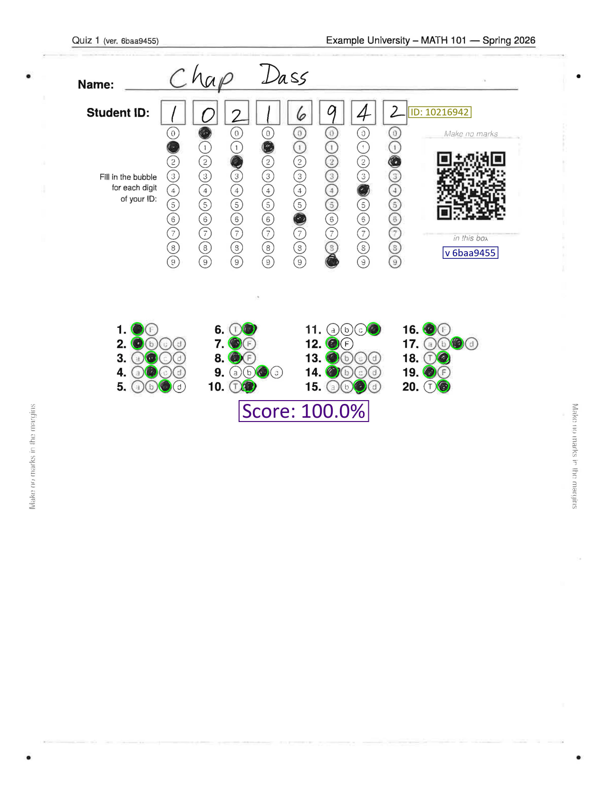
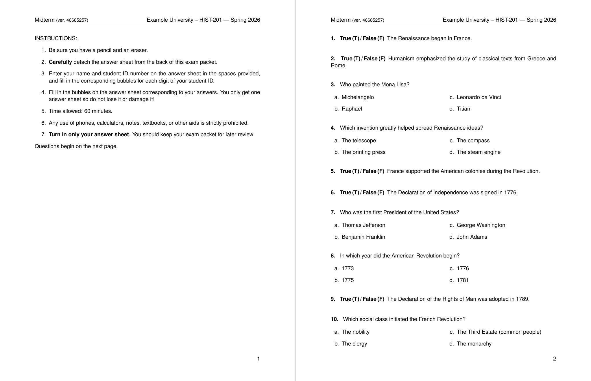
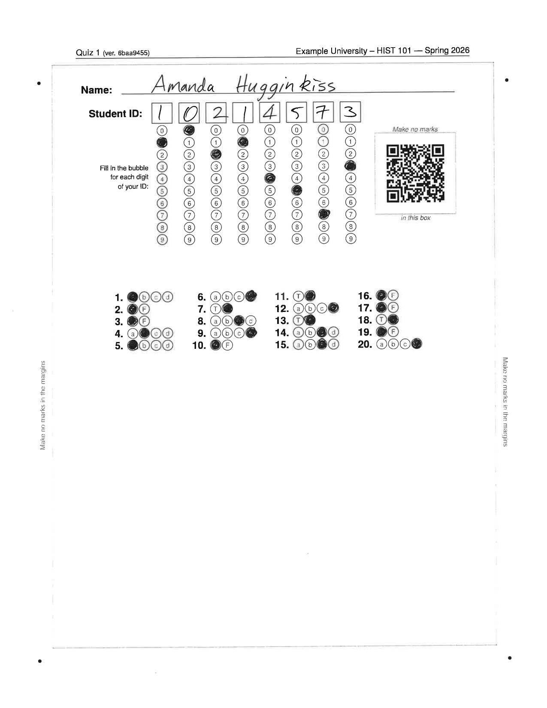
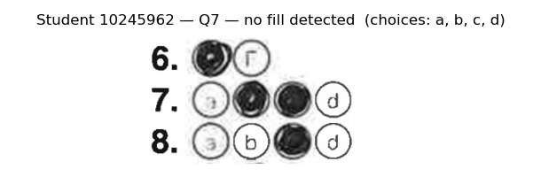
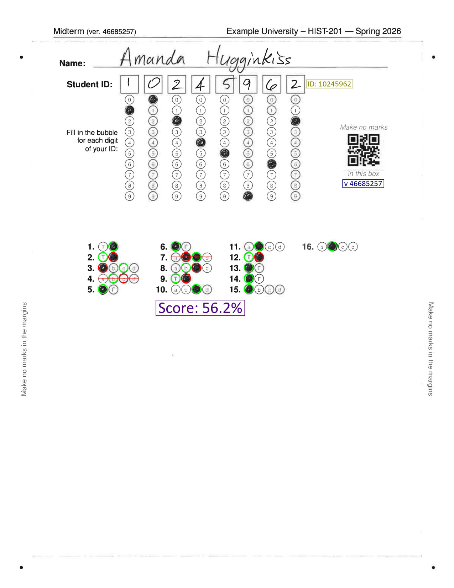
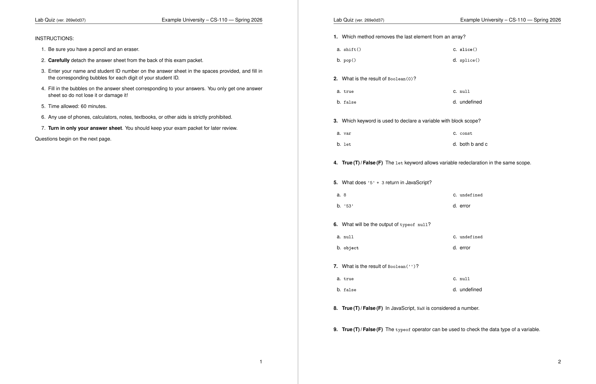
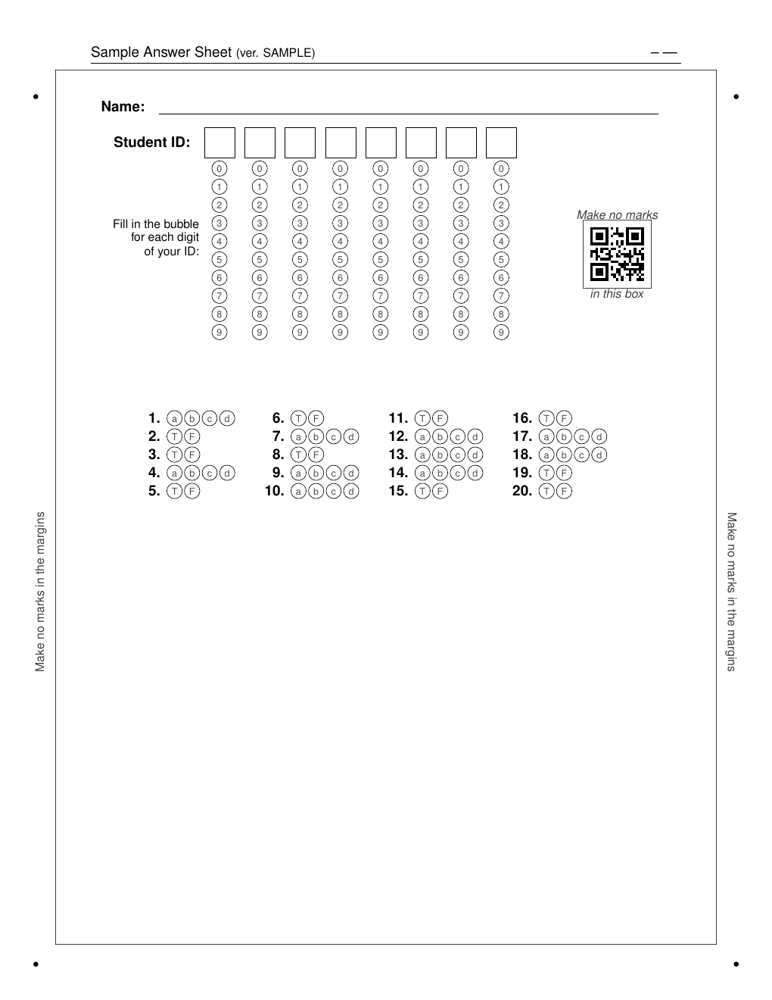
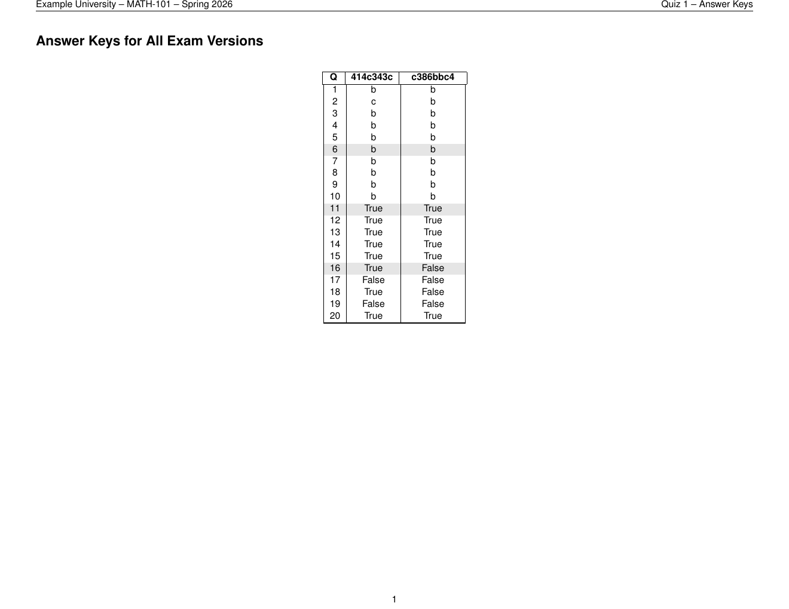

.. _examples:

Examples
========

This page walks through several concrete examples using the question banks
provided in ``examples/question_banks/``.  All commands below can be run
from the root of the repository with the package installed.

----

Math quiz (MCQ only, QR-encoded answers)
-----------------------------------------

The ``simple_math.yaml`` bank contains 120 arithmetic questions spread across
four topics: *integer addition*, *integer subtraction*, *integer multiplication*,
and *integer division*.

The following command generates **two randomised versions** of a 20-question
quiz with a 4-column answer sheet.  The ``--encode-answers-in-qr`` flag
encrypts the correct answers directly into each answer sheet's QR code, so
no separate answer-key file is needed at grading time.  ``-sc`` and ``-sq``
shuffle choices and questions independently for each version:

.. code-block:: bash

   pyaota build \
     --encode-answers-in-qr \
     --font-size 10pt \
     -q examples/question_banks/simple_math.yaml \
     -n 2 -nq 20 -nc 4 \
     --institution "Example University" \
     --course "MATH 101" --term "Spring 2026" \
     -en "Quiz 1" \
     -od build \
     -sc -sq

Output files in ``build/``:

- ``exam-<version>.pdf`` — one PDF per exam version (questions + answer sheet)
- ``exam_version_keys.csv`` — answer key for every version (kept as a backup)
- ``answer_keys-AnswerKeys.pdf`` — printable answer-key summary
- ``answersheet_layout.json`` — layout used by the grader; contains the
  encryption key needed to decode QR-embedded answers
- ``qr_<version>.png`` — pre-generated QR code images included in each PDF

**Instructions page and first questions page of a generated math quiz:**

Grading the math quiz
~~~~~~~~~~~~~~~~~~~~~

Because the answers are embedded in each answer sheet's QR code, no ``-k``
keyfile is required:

.. code-block:: bash

   pyaota grade \
       -i 1238_001.pdf \
       -alj build/answersheet_layout.json \
       -od graded

The grader reads the QR code, decrypts the answer key on the fly, and grades
the sheet entirely from information printed on the page.  If a QR code cannot
be read, running with ``--interactive`` will prompt for a keyfile as a fallback.

**Scanned answer sheet (student ID: 10216942, version: 6baa9455):**

**Graded answer sheet overlay:**

----

History exam (MCQ + True/False)
---------------------------------

The ``simple_history.yaml`` bank mixes MCQ and True/False questions across
eight topics.  This example draws 4 questions from each of four topics,
producing two randomised 16-question versions:

.. code-block:: bash

   pyaota build \
     -q examples/question_banks/simple_history.yaml \
     -n 2 -nq 16 -nc 4 \
     -t "Renaissance history" "American Revolution" \
        "French Revolution" "New World Explorers" \
     -od examples/generated/history_exam \
     --seed 42 \
     --institution "Example University" \
     --course "HIST-201" --term "Spring 2026" \
     -en "Midterm" \
     --cleanup --odd-page-answersheet

True/False questions are rendered with a bold ``True (T) / False (F)`` prefix
instead of a separate choices list, keeping the exam compact.

**Instructions page and first questions page of a generated history midterm:**

Grading the history midterm
~~~~~~~~~~~~~~~~~~~~~~~~~~~

After students complete the exam, scan all answer sheets to a single PDF and
run ``pyaota grade``.  The scanned PDF for this example is ``1236_001.pdf``
(one page, one student):

.. code-block:: bash

   cd examples/generated/history_exam
   pyaota grade \
       -i 1236_001.pdf \
       -k exam_version_keys.csv \
       -alj answersheet_layout.json \
       --interactive

**Scanned answer sheet (student: Amanda Hugginkiss, ID: 10245962, version: 46685257):**

With ``--interactive``, pyaota pauses on any question where no clear bubble
fill is detected and opens a matplotlib window showing a close-up of the
bubble row so the operator can confirm or supply the answer:

**Graded answer sheet overlay:**

The graded overlay marks each bubble green (correct) or red (incorrect) and
prints the final score.  Questions left ambiguous without ``--interactive``
(Q4 and Q7 here) are scored as wrong; running with ``--interactive`` would
allow the operator to resolve them and recover those points.

----

Programming quiz (code-block stems)
-------------------------------------

The ``simple_javascript.yaml`` bank contains questions whose stems include
fenced code blocks.  pyaota renders these using the ``lstlisting`` environment,
making it easy to ask students to interpret or debug code snippets.

.. code-block:: bash

   pyaota build \
     -q examples/question_banks/simple_javascript.yaml \
     -n 1 -nq 15 -nc 3 \
     -t "Basics" "Data types" "Arrays" \
     -od examples/generated/js_exam \
     --seed 7 \
     --institution "Example University" \
     --course "CS-110" --term "Spring 2026" \
     -en "Lab Quiz" \
     --cleanup --odd-page-answersheet --font-size 11pt

**Instructions page and first questions page of a generated JavaScript quiz:**

----

Compile-dump (review / proofreading)
--------------------------------------

The ``compile-dump`` subcommand renders every question in a bank into a single
PDF, with the correct answer highlighted.  This is useful for reviewing and
proofreading your question banks before exam day.

.. code-block:: bash

   pyaota compile-dump \
     -q examples/question_banks/simple_science.yaml \
     -od examples/generated/science_dump \
     --institution "Example University" \
     --course "SCI-101" --term "Spring 2026"

The output PDF shows each question with the correct choice circled.

----

Blank answer sheet
-------------------

You can generate a standalone blank answer sheet without building a full exam.
This is useful for printing spares or for a different question count than the
default:

.. code-block:: bash

   pyaota make-answersheet \
     -nq 20 -nc 4 -o answersheet_20q \
     -od examples/generated/answersheet

**Blank 20-question answer sheet:**

----

Answer keys summary
--------------------

After a ``build`` run, pyaota produces a printable answer-key PDF listing every
version with its correct answers, suitable for use at the grading station:

The companion ``exam_version_keys.csv`` can be passed directly to
``pyaota grade`` via ``-k``.

----

Tips
----

* Use ``--seed`` to make builds reproducible: the same seed always produces the
  same version ordering and question selection.
* Increase ``--num-exams`` (``-n``) to generate as many unique versions as
  needed for a large class.
* Add ``--encode-answers-in-qr`` to embed encrypted answers in each QR code —
  grading then requires only the ``answersheet_layout.json`` file, not a
  separate answer-key CSV.
* Add ``-sc`` / ``--shuffle-choices`` and ``-sq`` / ``--shuffle-questions`` to
  vary question and choice ordering across versions.
* Add ``--rasterize`` if your printer struggles with the TikZ-heavy answer sheet.
* Add ``--odd-page-answersheet`` for double-sided printing so the answer sheet
  always falls on the right-hand (odd) page.
* Use ``--font-size 10pt`` or ``11pt`` to fit more questions per page.
